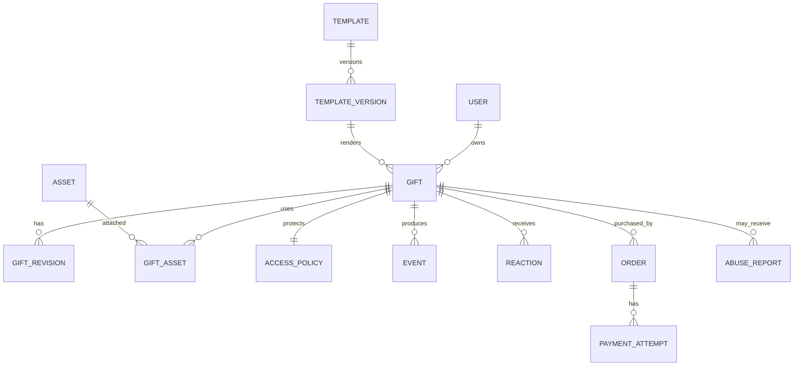

# LoveMemory — Đề án sản phẩm website tạo kỷ niệm cho các cặp đôi

> Phiên bản phân tích: 15/09/2026  
> Trạng thái: Product concept / định hướng MVP  
> Tên “LoveMemory” chỉ là tên làm việc, chưa phải đề xuất thương hiệu cuối cùng.

## 1. Tóm tắt điều hành

Ý tưởng có tiềm năng vì nó giải quyết một nhu cầu rất thật: người dùng muốn tạo một món quà giàu cảm xúc, có dấu ấn cá nhân, nhưng không biết thiết kế hoặc lập trình. Sản phẩm biến vài tấm ảnh, lời nhắn, ngày kỷ niệm và một bản nhạc thành một “nghi thức mở quà” trên trình duyệt; người nhận truy cập bằng link hoặc QR, không cần cài ứng dụng.

Tuy nhiên, “chọn template → nhập chữ/ảnh → nhận link/QR” đã là một thị trường có cạnh tranh. Harumi nhấn mạnh quà vật lý cá nhân hóa đi kèm QR; DearGift, LoveGift và nhiều dịch vụ khác đã cung cấp hiệu ứng 3D, ảnh, nhạc, link riêng, QR và thanh toán. Vì vậy, chỉ xây một kho animation lớn sẽ khó tạo lợi thế bền vững.

Hướng nên theo là:

> **LoveMemory giúp một người kể lại câu chuyện của hai người bằng một trải nghiệm mở quà tương tác, riêng tư, đẹp trên điện thoại và đủ bền để xem lại nhiều năm sau.**

Bốn lợi thế sản phẩm nên được ưu tiên:

1. **Story-first, không phải effect-first:** mỗi template là một kịch bản cảm xúc có mở đầu, cao trào và kết thúc, không chỉ là một hiệu ứng nền đổi được chữ.
2. **Khoảnh khắc trao–nhận trọn vẹn:** hỗ trợ hẹn giờ mở, QR đẹp để in, preview không làm lộ bất ngờ, và phản hồi riêng từ người nhận.
3. **Tin cậy và riêng tư:** link không đoán được, có mật khẩu/hẹn giờ/hết hạn, xóa dữ liệu rõ ràng, chống lộ nội dung qua preview khi gửi Zalo/Messenger.
4. **Cầu nối quà số và quà thật:** QR/NFC/card in là kênh phân phối và doanh thu, không chỉ là một tính năng phụ.

Khuyến nghị MVP: làm **3 template thật xuất sắc**, editor theo từng bước, preview đúng như bản thật, xuất bản link + QR, quản lý/sửa/xóa bằng magic link, và đo hành vi theo hướng tối thiểu dữ liệu. Không nên bắt đầu bằng editor kéo-thả, marketplace template, ứng dụng native hoặc hàng chục template chất lượng trung bình.

---

## 2. Vấn đề cần giải quyết

### 2.1. Nỗi đau của người tạo quà

- Muốn món quà “chỉ hai người mới hiểu”, nhưng thiệp/ảnh ghép có cảm giác quá quen thuộc.
- Có ảnh và câu chuyện nhưng không biết biến chúng thành một trải nghiệm có nhịp điệu.
- Công cụ thiết kế tổng quát cho quá nhiều lựa chọn; website code sẵn lại khó sửa, dễ lỗi trên điện thoại.
- Lo link lỗi, nhạc không chạy, ảnh tải chậm hoặc QR không quét được đúng lúc trao quà.
- Ngại đăng ảnh riêng tư lên một dịch vụ không nói rõ dữ liệu được giữ bao lâu.
- Thường chuẩn bị sát ngày, nên thời gian hoàn thành phải tính bằng phút, không phải giờ.

### 2.2. Nỗi đau của người nhận

- Không muốn đăng nhập hoặc cài app chỉ để xem một món quà.
- Link mở chậm, hiệu ứng giật hoặc âm thanh tự phát gây khó chịu.
- Nội dung dài nhưng không có nhịp kể chuyện; xem vài giây rồi thoát.
- Không có cách phản hồi tự nhiên sau khi xem xong.
- Muốn xem lại về sau nhưng link đã chết, nội dung đã thay đổi hoặc dịch vụ biến mất.

### 2.3. Jobs-to-be-done

**Công việc chức năng**

> Khi sắp đến một dịp đặc biệt, tôi muốn biến ảnh và lời nhắn của mình thành một món quà số đẹp trong dưới 10 phút, để có thể gửi bằng link hoặc đặt QR vào quà thật mà không cần biết thiết kế.

**Công việc cảm xúc**

> Tôi muốn người ấy cảm nhận rằng tôi đã nhớ những điều nhỏ và thực sự dành công sức cho món quà này.

**Công việc xã hội**

> Tôi muốn tạo một khoảnh khắc đủ đẹp để người nhận muốn lưu lại hoặc chia sẻ, nhưng quyền chia sẻ phải thuộc về họ.

### 2.4. Khoảnh khắc có nhu cầu cao

- Kỷ niệm 1 tháng, 100 ngày, 1 năm hoặc ngày cưới.
- Sinh nhật người yêu/vợ/chồng.
- Tỏ tình, cầu hôn, yêu xa, làm hòa.
- Valentine, 8/3, 20/10, Giáng sinh, Tết.
- Quà chia tay tích cực, cảm ơn hoặc lưu giữ một giai đoạn.

Sản phẩm nên tổ chức catalog theo **ý định và cảm xúc** (“tỏ tình”, “nhìn lại một năm”, “xin lỗi”, “yêu xa”) thay vì chỉ theo kỹ thuật (“WebGL”, “pháo hoa”, “3D”).

---

## 3. Đánh giá thị trường và cạnh tranh

### 3.1. Những gì có thể quan sát

| Nhóm/đối thủ | Giá trị đang cung cấp | Điểm mạnh có thể học | Khoảng trống để khác biệt |
|---|---|---|---|
| Harumi Gifts Box | Quà cá nhân hóa, khung ảnh/thiệp và QR mở nội dung số | Kết nối quà vật lý với cảm xúc số | Xây trải nghiệm số thành một câu chuyện dài hạn, có công cụ tự phục vụ mạnh |
| DearGift | Nhiều mẫu tỏ tình/sinh nhật/3D, ảnh, nhạc, preview, link, QR, mật khẩu, miễn phí và trả phí | Catalog rộng, quy trình dễ hiểu, không cần app | Chất lượng kể chuyện nhất quán, độ bền nội dung và trải nghiệm quản lý sau khi tặng |
| LoveGift | QR, pháo hoa, thiệp, sách truyện, photobooth, link ngắn, thanh toán | Viral loop và tiện ích miễn phí thu hút traffic | Định vị sâu hơn vào “ký ức của hai người”, privacy-by-design và phản hồi sau khi nhận |
| Các website effect/viral | Template theo trend TikTok, nhạc tùy chọn, tạo link nhanh | Nhanh ra nội dung, dễ lan truyền | Dễ bị sao chép; chất lượng, bản quyền, hiệu năng và sự tin cậy thường không đồng đều |
| Xưởng quà NFC/handmade | Thẻ/cassette/polaroid chạm để mở ảnh, nhạc và lời nhắn | Vật phẩm thật làm tăng giá trị cảm nhận | LoveMemory có thể trở thành hạ tầng nội dung cho nhiều xưởng thay vì tự sản xuất mọi món quà |

Thông tin trong bảng là ảnh chụp thị trường tại thời điểm viết, dựa trên nội dung công khai của các website; không phải kiểm toán tính năng hay số liệu kinh doanh.

### 3.2. Kết luận cạnh tranh

- Nhu cầu đã được chứng minh ở mức định tính, nhưng feature cơ bản đã trở thành “table stakes”.
- Animation đơn lẻ có chi phí sao chép thấp. Thư viện càng lớn càng tạo gánh nặng kiểm thử và bảo trì.
- Lợi thế khó sao chép hơn nằm ở: kịch bản nội dung, dữ liệu ký ức có cấu trúc, mạng lưới creator/xưởng quà, độ tin cậy của link, và thương hiệu được tin cậy với ảnh riêng tư.
- “Viral” giúp thu hút người dùng, nhưng **khoảnh khắc riêng tư** mới là giá trị được trả tiền. Hai chế độ cần tách rõ.

### 3.3. Định vị đề xuất

Không định vị là “trình tạo website” hay “kho code tỏ tình”. Định vị là:

> **Một món quà ký ức tương tác — tự tay tạo trong vài phút, mở bằng một chạm, lưu lại cho nhiều năm.**

Thông điệp phụ:

- Cho người tạo: “Bạn mang ký ức; LoveMemory giúp kể thành câu chuyện.”
- Cho người nhận: “Không app, không đăng nhập, chỉ có một điều dành riêng cho bạn.”
- Cho đối tác quà tặng: “Thêm một lớp cảm xúc số vào mọi món quà vật lý.”

---

## 4. Tầm nhìn sản phẩm

### 4.1. Vòng đời của một món quà

Sản phẩm không kết thúc khi tạo URL. Vòng đời đúng là:

1. **Gợi nhớ:** giúp người tạo chọn câu chuyện và tìm lại chi tiết đáng nhớ.
2. **Sáng tạo:** biến nội dung thành trải nghiệm mà không cần kỹ năng thiết kế.
3. **Chuẩn bị:** preview, sửa lỗi, đặt thời điểm mở, chọn cách bảo vệ.
4. **Trao:** link, QR, NFC hoặc card in.
5. **Mở:** tạo nghi thức tương tác, chủ động bật nhạc, tải nhanh trên mobile.
6. **Đáp lại:** emoji/lời nhắn/ảnh phản hồi riêng nếu cả hai đồng ý.
7. **Lưu giữ:** xem lại, làm mới vào năm sau, xuất bản lưu trữ hoặc gia hạn.

### 4.2. Nguyên tắc thiết kế

- **Người nhận là trung tâm:** editor là phễu tạo ra trải nghiệm cho người nhận.
- **Authenticity over AI:** AI có thể gợi ý, nhưng không được làm lời nhắn trở nên chung chung hoặc giả tạo.
- **Mobile-first thực sự:** thiết kế và kiểm thử từ màn hình nhỏ, mạng 4G yếu, một tay cầm điện thoại.
- **Progressive delight:** nội dung cốt lõi phải xem được trước; hiệu ứng nặng tải sau và có fallback.
- **No-surprise privacy:** trước khi publish phải biết chính xác ai có thể xem, dữ liệu giữ bao lâu và cách xóa.
- **Published means reproducible:** một món quà đã publish không tự đổi chỉ vì template được cập nhật.
- **Accessible romance:** có giảm chuyển động, caption/transcript, tương phản đủ tốt và điều khiển âm thanh.

---

## 5. Trải nghiệm người dùng đề xuất

### 5.1. Luồng của người tạo

1. Chọn dịp hoặc mục tiêu cảm xúc.
2. Xem demo bằng dữ liệu mẫu ngay trên điện thoại; hiển thị thời lượng và số ảnh cần chuẩn bị.
3. Chọn template.
4. Trả lời form dạng “story prompts”, ví dụ:
   - Hai bạn gọi nhau là gì?
   - Khoảnh khắc đầu tiên muốn nhắc lại?
   - Điều nhỏ nhất ở người ấy mà bạn yêu?
   - Lời nhắn chỉ mở ở cảnh cuối?
5. Tải ảnh, crop theo từng slot, sắp xếp thứ tự; hệ thống cảnh báo ảnh mờ hoặc sai tỷ lệ.
6. Chọn theme và một track từ thư viện có quyền sử dụng; nghe thử 10–15 giây.
7. Preview bằng đúng renderer của trang nhận quà, có thanh tiến trình và nút quay lại đúng trường đang sửa.
8. Chọn quyền truy cập: unlisted, mật khẩu hoặc hẹn giờ mở.
9. Publish; thanh toán nếu dùng gói trả phí.
10. Nhận:
    - URL ngắn, dễ sao chép;
    - QR PNG để gửi online;
    - QR SVG/PDF chất lượng in;
    - mẫu card 9 × 5,4 cm hoặc postcard A6;
    - trang quản lý để sửa, tạm ẩn, gia hạn, tải lại QR hoặc xóa.

**Tối ưu quan trọng:** cho phép thử template và tạo draft không cần tài khoản. Chỉ yêu cầu email/magic link khi publish hoặc khi cần lưu trên nhiều thiết bị. Điều này giảm ma sát nhưng vẫn có cơ chế khôi phục quyền sở hữu.

### 5.2. Luồng của người nhận

1. Mở link/QR và thấy một cover rất nhẹ, không tiết lộ nội dung riêng tư.
2. Nếu chưa đến giờ: countdown và thông điệp teaser an toàn.
3. Nhấn “Mở món quà”. Cú chạm này đồng thời khởi động animation và xin phát nhạc, phù hợp với chính sách autoplay của trình duyệt.
4. Nội dung chạy theo từng cảnh; người nhận có thể chạm/scroll nhưng không bị mắc kẹt nếu bỏ qua tương tác.
5. Luôn có pause, mute, replay và chế độ giảm chuyển động.
6. Kết thúc bằng một CTA duy nhất: “Gửi lại một cảm xúc” hoặc “Lưu món quà”. Không đặt quảng cáo chen vào cao trào.
7. Nếu người tạo cho phép, người nhận có thể chia sẻ; mặc định là riêng tư.

### 5.3. Các chi tiết dễ bị bỏ quên

- Preview của Zalo/Messenger có thể làm lộ tên hoặc ảnh. Mặc định Open Graph nên dùng cover chung; chỉ dùng ảnh cá nhân khi chủ sở hữu bật rõ ràng.
- Bot tạo preview có thể truy cập link trước người nhận. Không được tính request đầu tiên là “đã mở”, và không nên vô hiệu hóa link một lần chỉ dựa trên request HTTP đầu tiên.
- QR chỉ chứa URL HTTPS, không chứa lời nhắn, tên, email hoặc dữ liệu cá nhân.
- QR nghệ thuật phải giữ độ tương phản, quiet zone và được test bằng camera thật ở kích thước in dự kiến.
- Âm thanh không được phụ thuộc vào autoplay; nút “Mở quà” là user gesture tự nhiên để bắt đầu nhạc.
- Luôn có phiên bản không nhạc, không WebGL và giảm chuyển động.

---

## 6. Hệ thống template — tài sản cốt lõi

### 6.1. Không coi template là một file HTML tùy ý

Nếu mỗi template là một thư mục HTML/CSS/JS tự phát, sản phẩm sẽ nhanh chóng gặp các vấn đề:

- Mỗi mẫu có form và quy tắc dữ liệu riêng nhưng không có hợp đồng chung.
- Code cũ làm hỏng sau khi runtime thay đổi.
- Template có thể đọc dữ liệu/cookie không thuộc phạm vi của nó hoặc gọi mạng tùy ý.
- Không thể tự động tạo editor, validate input, render thumbnail hoặc đo performance.
- Sửa template mới vô tình làm thay đổi món quà đã publish từ trước.

Template nên là **module có version**, chạy trên một runtime chuẩn và nhận dữ liệu đã validate.

### 6.2. Template manifest đề xuất

```json
{
  "id": "memory-gift-box",
  "version": "1.2.0",
  "engineVersion": "1.x",
  "status": "published",
  "meta": {
    "name": "Hộp ký ức",
    "occasions": ["anniversary", "birthday"],
    "moods": ["warm", "playful"],
    "estimatedDurationSec": 75
  },
  "entry": "index.js",
  "schema": {
    "senderName": {"type": "shortText", "required": true, "max": 40},
    "receiverName": {"type": "shortText", "required": true, "max": 40},
    "headline": {"type": "text", "required": true, "max": 120},
    "photos": {"type": "imageList", "min": 3, "max": 8, "aspect": "4:5"},
    "finalMessage": {"type": "richText", "required": true, "max": 1200},
    "theme": {"type": "enum", "values": ["rose", "midnight", "cream"]},
    "music": {"type": "licensedAudio", "required": false}
  },
  "capabilities": ["audio", "canvas2d"],
  "budgets": {
    "initialJsKbGzip": 120,
    "initialMediaKb": 700,
    "maxTextureMb": 32
  },
  "previewFixture": "fixtures/demo.json"
}
```

Schema phải đủ giàu để tự sinh editor nhưng vẫn cho phép template khai báo nhóm bước, conditional field, helper text, crop ratio và custom validator.

### 6.3. Hợp đồng runtime

Mỗi template triển khai một giao diện tối thiểu:

```ts
interface MemoryTemplate {
  mount(root: HTMLElement, payload: ValidatedGift, context: RuntimeContext): void;
  play(): Promise<void>;
  pause(): void;
  seek?(scene: string): void;
  onVisibilityChange?(visible: boolean): void;
  destroy(): void;
}
```

`RuntimeContext` cung cấp audio controller, asset resolver, analytics tối thiểu, locale, viewport, `prefers-reduced-motion` và API phát sự kiện. Template không được tự ý đọc cookie, local storage hoặc gửi request ra domain ngoài.

### 6.4. Cách ly và bảo mật

- Giai đoạn đầu chỉ nhận template nội bộ đã review; không chạy HTML/JS do end user tải lên.
- Render template trong sandboxed iframe hoặc một boundary tương đương. Giao tiếp qua `postMessage` có schema/type rõ ràng.
- Áp dụng Content Security Policy chặt; chỉ cho tải asset từ CDN được phép.
- Không dùng `innerHTML` với nội dung người dùng. Rich text chỉ cho một tập tag nhỏ và sanitize ở cả server lẫn client.
- Template khai báo capability; camera, microphone, location và network ngoài bị từ chối mặc định.
- Có kill switch cho một version lỗi, nhưng không chỉnh sửa âm thầm nội dung đã publish.

### 6.5. Version và tính bất biến

- `Gift` đã publish luôn trỏ tới `template_version_id` cụ thể và một `content_snapshot`.
- Template version mới không làm thay đổi bản cũ.
- Khi chủ sở hữu sửa nội dung, tạo revision rồi publish atomically; người xem không bao giờ thấy trạng thái nửa cũ nửa mới.
- Security patch ở runtime dùng backward compatibility; nếu phải thay bundle, cần migration được kiểm thử và lưu dấu thay đổi.
- Khi ngừng một template, không cho tạo quà mới nhưng vẫn phục vụ bản đã publish trong thời hạn cam kết.

### 6.6. Quality gate cho template

Mỗi version chỉ được publish khi đạt:

- Schema hợp lệ và fixture render được.
- Visual regression ở các viewport chính.
- Chạy trên Safari iOS, Chrome Android và desktop phổ biến.
- Không lỗi khi ảnh thiếu, text dài, emoji, tiếng Việt có dấu hoặc tên rất ngắn/dài.
- Có reduced-motion fallback.
- Có giới hạn FPS/CPU và không tiếp tục animation khi tab bị ẩn.
- Đạt performance budget và không gọi endpoint ngoài allowlist.
- Có ảnh thumbnail, video demo ngắn, mô tả input cần chuẩn bị và thời lượng trải nghiệm.

---

## 7. Bộ template nên phát triển

### 7.1. Ba template cho MVP

**1. Hộp ký ức — “The Reveal”**

- Tap tháo nơ, mở hộp, 3–8 polaroid bay ra theo thứ tự.
- Mỗi ảnh có một câu ngắn; cảnh cuối mở lá thư dài.
- Lợi thế: ai cũng hiểu cách tương tác; rất hợp QR gắn vào hộp quà thật.

**2. Dòng thời gian hai đứa — “Our Little History”**

- 4–7 mốc: lần đầu gặp, chuyến đi, câu nói vui, ngày hôm nay.
- Scroll hoặc tap qua từng mốc, kết thúc bằng “chương tiếp theo”.
- Lợi thế: biến dữ liệu ký ức thành câu chuyện; dễ tái sử dụng cho kỷ niệm năm sau.

**3. Bầu trời lời nhắn — “Midnight Wish”**

- Cover tối, người nhận chạm các vì sao để hiện câu ngắn; cao trào là pháo hoa/tên và thư cuối.
- Có canvas 2D fallback, không bắt buộc WebGL.
- Lợi thế: tạo wow moment nhưng input ít, phù hợp tỏ tình/sinh nhật.

Ba mẫu này bao phủ ba mức công sức: nhanh, giàu câu chuyện và giàu hiệu ứng.

### 7.2. Ý tưởng sau MVP

- **Cassette của chúng ta:** mixtape, voice note, ảnh theo từng track; cần giải quyết bản quyền nhạc.
- **Phòng trưng bày tí hon:** đi qua các khung ảnh trong một căn phòng 2.5D.
- **Bức thư mở đúng lúc:** hẹn giờ, wax seal, confetti; ưu tiên sự riêng tư.
- **Khoảng cách hóa thành đường về:** hai địa điểm, timeline yêu xa; location là dữ liệu nhạy cảm nên chỉ lưu mức thành phố nếu đủ dùng.
- **Một năm của chúng ta:** tự động gom 12 khoảnh khắc thành recap.
- **Chuyện của hai người:** người nhận mở khóa một bước đồng sáng tạo và thêm ký ức của họ.
- **Vườn ký ức:** mỗi ảnh là một bông hoa; khu vườn lớn lên qua các năm.
- **Time capsule:** khóa đến một ngày tương lai, có bản nhắc và cơ chế khôi phục quyền sở hữu.

### 7.3. Khung chấm điểm template mới

Chấm 1–5 theo các tiêu chí, chỉ làm mẫu có tổng điểm tốt:

- Mức độ tạo cảm xúc/wow.
- Mức độ cá nhân hóa có ý nghĩa.
- Số phút và lượng nội dung cần để hoàn thành.
- Khả năng chạy ổn trên thiết bị tầm trung.
- Khả năng dùng lại cho nhiều dịp.
- Tiềm năng minh họa trong video TikTok/Reels.
- Rủi ro bản quyền, riêng tư và moderation.
- Chi phí bảo trì/test qua các trình duyệt.

---

## 8. Phạm vi MVP

### 8.1. Must-have

- Landing page và catalog lọc theo dịp/cảm xúc.
- Demo template với fixture data.
- 3 template như mục 7.1.
- Editor theo schema: text, long text, date, image list, crop/reorder, theme, licensed audio.
- Autosave draft cục bộ; lưu cloud khi xác thực bằng email magic link.
- Preview mobile/desktop dùng cùng renderer với trang thật.
- Publish/unpublish, random public URL, QR PNG và SVG.
- Ba chế độ: unlisted, mật khẩu, hẹn giờ mở.
- Trang quản lý: sửa, xem trạng thái, gia hạn, xóa.
- Viewer không cần tài khoản; start/pause/mute/replay/reduced motion.
- Nén ảnh, xóa EXIF, validate file, responsive derivatives.
- Analytics tổng hợp cho funnel và lỗi kỹ thuật; không cần fingerprinting.
- Admin tối thiểu: quản lý template version, gift report, takedown, payment/refund status.
- Điều khoản, chính sách riêng tư, consent upload và luồng yêu cầu xóa/report.

### 8.2. Should-have ngay sau MVP

- Card QR in sẵn theo nhiều kích thước.
- Phản hồi emoji/lời nhắn riêng tư và thông báo cho người tạo.
- Duplicate món quà cho dịp năm sau.
- Scheduled publish/unlock có timezone rõ ràng.
- Link alias tùy chỉnh nhưng vẫn giữ ID ngẫu nhiên bên trong.
- Dashboard báo “đã mở” sau khi xác định tương tác của người thật, không dựa vào bot preview.
- Coupon/referral và landing theo mùa.
- Export gói lưu trữ tĩnh hoặc video recap để giảm nỗi lo link biến mất.

### 8.3. Chưa nên làm

- Editor kéo-thả tự do kiểu Canva.
- Marketplace cho người dùng tải JavaScript/template tùy ý.
- Feed công khai hoặc mạng xã hội cặp đôi.
- Ứng dụng iOS/Android native.
- AR/VR phức tạp và 3D nặng là điều kiện bắt buộc.
- Upload bài hát thương mại tùy ý khi chưa có chiến lược bản quyền.
- AI tự viết toàn bộ lời yêu thương rồi trình bày như lời của người dùng.
- Subscription là mô hình duy nhất; tần suất mua quà của một cá nhân không đủ đều.

---

## 9. Mô hình dữ liệu



### 9.1. Thực thể chính

**Gift**

- `id`: khóa nội bộ.
- `public_id`: token ngẫu nhiên ít nhất 128-bit; không dùng ID tăng dần.
- `owner_id`: có thể nullable khi là draft local, bắt buộc trước publish cloud.
- `template_version_id`.
- `content_snapshot`: JSON đã validate; không chứa URL upload tạm.
- `status`: `draft | scheduled | published | paused | expired | deleted`.
- `visibility`: `unlisted | password | scheduled` ở MVP; public gallery là sản phẩm khác.
- `published_at`, `unlock_at`, `expires_at`, `deleted_at`.
- `created_timezone`: để diễn giải đúng thời điểm 0:00 người dùng đã chọn.

**GiftRevision**

- Nội dung versioned, ai sửa, thời điểm, trạng thái draft/published.
- Cho rollback an toàn và tránh ghi đè khi mở editor ở hai thiết bị.

**Asset**

- Object key, chủ sở hữu, MIME được phát hiện từ nội dung, kích thước, checksum.
- Trạng thái `uploaded | scanning | processing | ready | rejected | deleted`.
- Derivatives theo viewport/format; originals có retention riêng.

**AccessPolicy**

- Password hash, giới hạn thử, unlock time, expiry, allow-share flag.
- Không lưu password thuần; không nhúng secret quản trị vào public URL.

**Event**

- Các sự kiện cần thiết như `gift_started`, `scene_completed`, `gift_completed`, `reaction_sent`.
- Không lưu raw IP lâu dài nếu không thực sự cần; bot classification tách biệt với view của người thật.

### 9.2. Quy tắc dữ liệu quan trọng

- Draft asset nằm ở bucket/private prefix; chỉ promote derivative cần thiết khi publish.
- Public gift không đồng nghĩa với asset có tên dễ đoán. URL asset dùng key ngẫu nhiên và policy CDN phù hợp.
- Xóa gift phải đưa vào hàng đợi xóa content, derivative, original, event chi tiết và cache/CDN; trạng thái xóa phải quan sát được.
- Dữ liệu thanh toán không trộn vào content gift; chỉ lưu reference cần thiết từ nhà cung cấp thanh toán.
- Slug có thể đẹp nhưng chỉ mang tính trình bày; routing và bảo mật dựa vào `public_id` ngẫu nhiên.

---

## 10. Kiến trúc kỹ thuật đề xuất

### 10.1. Kiến trúc logic

```text
Browser
├── Marketing/Catalog (SEO, server-rendered)
├── Studio (schema-driven editor + preview)
└── Gift Viewer (lightweight runtime + sandboxed template)
        │
        ▼
Web/API application
├── Auth & ownership
├── Gift/revision/access policy
├── Template registry
├── Upload/asset processing orchestration
├── Publish, QR, thumbnail/OG image
├── Order/payment webhook
└── Moderation/reporting/admin
        │
        ├── PostgreSQL
        ├── Object storage + CDN
        ├── Job queue
        └── Email/notification provider
```

### 10.2. Stack hợp lý cho MVP

Một lựa chọn cân bằng tốc độ và khả năng mở rộng:

- **TypeScript end-to-end.**
- **Next.js/React** cho marketing, catalog và Studio; SSR/SSG cho trang cần SEO.
- **Viewer runtime nhẹ**, hạn chế phụ thuộc React trong bundle đầu; template canvas/DOM tùy mẫu.
- **PostgreSQL** cho quan hệ, transaction publish/order và JSONB content đã validate.
- **S3-compatible object storage + CDN** cho ảnh, audio, template bundle và derivative.
- **Queue/job runner** cho resize, scan, thumbnail, cleanup, email và webhook retry.
- **Schema validation dùng chung** giữa manifest, API và client.
- **Infrastructure managed** ở giai đoạn đầu để tập trung vào sản phẩm; chưa cần microservices.

Có thể bắt đầu bằng một modular monolith. Ranh giới module rõ hơn số lượng service. Tách asset processing hoặc viewer delivery khi tải thực tế chứng minh cần thiết.

### 10.3. Quy trình upload media

1. Client xin signed upload URL sau khi server kiểm tra quota và loại file dự kiến.
2. Upload trực tiếp vào object storage, không đi xuyên application server.
3. Worker kiểm tra MIME thật, kích thước, malware và decode được file.
4. Xóa metadata EXIF, đặc biệt GPS.
5. Tạo kích thước responsive và định dạng tối ưu; giữ fallback tương thích.
6. Gắn asset `ready`, rồi editor mới cho phép publish.
7. Asset upload dở/không gắn vào gift được garbage-collect sau thời hạn ngắn.

### 10.4. Publish atomically

Publish cần là một transaction logic:

- Validate content theo đúng schema của template version.
- Xác nhận tất cả asset đã `ready` và thuộc owner.
- Xác nhận quyền sử dụng/gói thanh toán.
- Tạo immutable snapshot.
- Tạo access policy và public ID.
- Promote/cache asset cần thiết.
- Sau commit mới phát job QR, OG image và thông báo.

Nếu job phụ thất bại, gift vẫn có URL hoạt động và hệ thống retry; không để thanh toán thành công nhưng trang nhận quà là 404.

### 10.5. URL và QR

Ví dụ:

```text
https://lovememory.vn/g/7Yp4qN8uK2/minh-va-an
https://lovememory.vn/manage/<owner-session-or-auth-route>
```

- `7Yp4qN8uK2` chỉ là minh họa; token thực phải có entropy đủ cao.
- Phần slug không dùng để phân quyền và có thể đổi mà không làm chết link cũ.
- URL quản trị không xuất hiện trong QR.
- QR chuẩn là mặc định; QR trang trí là tùy chọn sau khi đạt kiểm thử scan.

### 10.6. Hiệu năng

Mục tiêu nên được kiểm thử ở p75 trên mobile thực tế:

- LCP ≤ 2,5 giây.
- INP ≤ 200 ms.
- CLS ≤ 0,1.
- Cover và CTA mở quà nằm trong HTML/CSS ban đầu.
- Bundle viewer shell rất nhỏ; template và media tải theo cảnh.
- Ảnh đầu tiên có placeholder; ảnh sau preload có kiểm soát.
- Pause `requestAnimationFrame`, audio và particle system khi tab ẩn.
- Giảm mật độ particle/texture theo device capability; không dựa chỉ vào kích thước màn hình.
- Nếu WebGL context mất hoặc GPU yếu, chuyển sang canvas/DOM fallback.

### 10.7. Khả năng vận hành lâu dài

- Database backup tự động và diễn tập restore định kỳ.
- Object versioning hoặc soft-delete có retention ngắn để cứu lỗi vận hành.
- Error tracking theo template version, browser và device class.
- Synthetic test hằng ngày: mở một gift canary, tải asset, chạy một interaction, kiểm tra QR route.
- Theo dõi tỷ lệ 404/5xx, asset processing failure, payment-webhook lag và publish latency.
- Không quảng cáo “vĩnh viễn” nếu chưa có cơ chế tài chính/kỹ thuật bảo đảm. Cam kết 1/3/5 năm, gia hạn, và cung cấp export là trung thực hơn.

---

## 11. An toàn, riêng tư và pháp lý

Đây là phần cốt lõi vì sản phẩm lưu khuôn mặt, tên, giọng nói, ngày đặc biệt và đôi khi cả địa điểm của người không trực tiếp tạo tài khoản.

### 11.1. Privacy-by-design

- Mặc định `unlisted`, không đưa gift vào sitemap, search engine hoặc gallery.
- Nói rõ: “Ai có link đều có thể xem” không đồng nghĩa với riêng tư tuyệt đối.
- Cho phép password, hẹn giờ, tạm ẩn và xóa không cần liên hệ support.
- Không đưa dữ liệu cá nhân vào title/OG metadata mặc định.
- Thu thập ít nhất có thể; không yêu cầu ngày sinh, giới tính, số điện thoại nếu không cần.
- Consent tách theo mục đích: vận hành gift, marketing, analytics và nội dung công khai không gộp thành một checkbox.
- Có cơ chế để người xuất hiện trong ảnh/nội dung báo cáo và yêu cầu gỡ, kể cả khi họ không phải owner.
- Công bố retention cho draft, original upload, published derivative, event và backup.
- Khi dùng nhà cung cấp ngoài hoặc chuyển dữ liệu xuyên biên giới, cần đánh giá nghĩa vụ tương ứng trước khi launch.

Luật Bảo vệ dữ liệu cá nhân số 91/2025/QH15 đã có hiệu lực từ 01/01/2026 và ghi nhận các quyền như được biết, đồng ý, truy cập, chỉnh sửa và yêu cầu xóa. Thiết kế dữ liệu và quy trình vận hành phải được rà soát pháp lý thực tế trước khi thương mại hóa; tài liệu này không thay thế tư vấn pháp lý.

### 11.2. Security baseline

- HTTPS toàn bộ; mã hóa at rest theo khả năng của database/object provider.
- Password gift băm bằng thuật toán password-hashing phù hợp, có rate limit và chống brute force.
- Session quản trị `HttpOnly`, `Secure`, `SameSite`; chống CSRF ở mutation route.
- CSP nghiêm ngặt, sanitize input, encode output, giới hạn URL/protocol.
- Signed upload ngắn hạn; giới hạn loại file, byte size, pixel count và thời lượng media.
- Webhook thanh toán xác minh chữ ký, idempotency key và trạng thái server-side.
- Admin bắt buộc MFA, audit log và phân quyền tối thiểu.
- Không để template đọc secret, owner email hoặc analytics identifiers.
- Dependency scanning và quy trình thu hồi template version khi có lỗ hổng.

### 11.3. Abuse và nội dung nhạy cảm

Các tình huống cần dự liệu: quấy rối sau chia tay, doxxing, giả mạo, đăng ảnh thân mật không đồng thuận, nội dung liên quan trẻ vị thành niên, mã độc trong link/asset và spam QR.

MVP tối thiểu cần:

- Acceptable Use Policy rõ ràng.
- Nút report dễ thấy nhưng không phá trải nghiệm.
- Hàng đợi review, mức độ khẩn cấp và playbook takedown.
- Khả năng pause gift ngay, bảo toàn audit evidence có thời hạn và thông báo owner phù hợp.
- Chặn executable/SVG nguy hiểm; ảnh upload phải được decode và re-encode.
- Rate limit tạo/publish/report; bot protection cân bằng để không cản người nhận.
- Không mở public gallery trước khi có moderation đủ trưởng thành.

### 11.4. Bản quyền

- Thư viện nhạc/illustration/font phải có license phù hợp với việc nhúng vào sản phẩm thương mại và phân phối lại cho gift page.
- Ở MVP nên cung cấp track đã cấp phép hoặc cho phép link tới nguồn có API/điều khoản phù hợp; không mặc định cho upload bất kỳ bài hát thương mại nào.
- Người upload phải xác nhận có quyền/được phép dùng ảnh, audio và nội dung của người khác.
- Có quy trình notice-and-takedown và lưu thông tin license của từng asset hệ thống.

---

## 12. Mô hình kinh doanh

### 12.1. Đặc tính kinh tế

Tạo quà là hành vi không đều; phần lớn cá nhân không cần subscription hàng tháng. Mô hình chính nên là **trả tiền theo món quà**, kết hợp free acquisition và doanh thu B2B.

### 12.2. Gói đề xuất để thử nghiệm

Các mức dưới đây là giả thuyết cần A/B test, không phải kết luận về willingness-to-pay:

| Gói | Phạm vi gợi ý | Mục tiêu |
|---|---|---|
| Free/Demo | 1 mẫu nhẹ, tối đa 3 ảnh, watermark nhỏ, link 7–14 ngày | Cho người dùng trải nghiệm và tạo viral loop |
| Standard | 1 gift, 1 năm, 8–12 ảnh, QR HD, không watermark, mật khẩu | Sản phẩm chủ lực; thử vùng giá khoảng 39.000–69.000đ |
| Premium | 1 gift, 3–5 năm, template cao cấp, scheduled reveal, voice/reaction, export | Tăng giá trị; thử vùng giá khoảng 99.000–199.000đ |
| Partner | Credit số lượng lớn, white-label nhẹ, QR/NFC mapping, dashboard đơn hàng | Xưởng quà, studio ảnh, florist, wedding planner |

Không dùng từ “lưu trữ vĩnh viễn” nếu không có quỹ vận hành, điều khoản và phương án export. “Bao gồm 3 năm, gia hạn bất kỳ lúc nào, tải bản lưu trữ” dễ tin hơn.

### 12.3. Kênh doanh thu mở rộng

- Template premium theo mùa.
- Card QR, NFC tag hoặc hộp quà qua đối tác; tránh ôm vận hành vật lý quá sớm.
- White-label cho cửa hàng quà tặng.
- Creator royalty/marketplace sau khi có sandbox, review và license workflow.
- Couple memory space theo năm chỉ sau khi chứng minh được hành vi quay lại.
- Add-on: voice message, video export, custom domain, tăng thời hạn, in và giao card.

### 12.4. Unit economics cần đo

- Phí thanh toán trên mỗi order.
- Chi phí lưu trữ original/derivative theo năm.
- CDN bandwidth, đặc biệt với audio/video và traffic spike lúc 0:00.
- Chi phí email/OTP, resize/thumbnail, moderation và support.
- Refund/chargeback và tỷ lệ gift không được mở.
- Chi phí sản xuất, QA và bảo trì cho mỗi template.

Một template không chỉ có chi phí tạo ban đầu; nó là một phiên bản phần mềm phải hỗ trợ nhiều năm.

---

## 13. Go-to-market

### 13.1. Wedge ban đầu

Tập trung một use case rõ thay vì “quà cho mọi người”:

> **Kỷ niệm yêu nhau dành cho Gen Z và cặp đôi trẻ, tạo trên mobile, gửi qua Zalo/Messenger hoặc gắn QR vào quà thật.**

Sau khi có dữ liệu mới mở sang sinh nhật bạn thân, gia đình, thiệp cưới hoặc doanh nghiệp.

### 13.2. Kênh tăng trưởng

- TikTok/Reels: video reaction và before/after, nhưng phải có sự đồng ý của cả hai.
- SEO theo intent: “web kỷ niệm 1 năm yêu nhau”, “QR lời nhắn cho người yêu”, “quà yêu xa”, không chỉ “web tỏ tình”.
- Template landing theo mùa, publish trước dịp cao điểm 4–6 tuần.
- Referral sau khi người nhận hoàn thành: “Tạo một món quà của riêng bạn”, đặt nhẹ sau CTA phản hồi.
- Đối tác florist, tiệm ảnh, handmade, in card, hộp quà và NFC.
- Mã partner/QR pre-provisioned: xưởng bán vật phẩm, người mua quét mã quản trị để điền nội dung, sau đó vật phẩm mở public gift.

### 13.3. Loop tăng trưởng tự nhiên

```text
Người A tạo gift
→ Người B mở và phản hồi
→ B thấy trải nghiệm mẫu sau khi kết thúc
→ B tạo gift cho A/người khác
→ A quay lại để bổ sung kỷ niệm năm sau
```

Loop này chỉ hoạt động nếu branding/referral không chen vào khoảnh khắc chính và nội dung không bị công khai mặc định.

---

## 14. Chỉ số thành công

### 14.1. North-star metric

**Số “món quà được trao thành công” mỗi tuần**, định nghĩa là:

- gift đã publish;
- có ít nhất một phiên người nhận được xác định là tương tác thật;
- người nhận bắt đầu và đi đến cảnh cuối hoặc gửi phản hồi.

Chỉ đếm số gift được tạo sẽ khuyến khích template rác; chỉ đếm page view sẽ bị bot preview và spam làm sai.

### 14.2. Funnel cần theo dõi

- Catalog view → template demo.
- Demo → bắt đầu customize.
- Start → hoàn tất input tối thiểu.
- Input complete → preview.
- Preview → publish intent.
- Publish intent → payment success.
- Publish → người nhận mở trong 24/72 giờ.
- Start gift → scene cuối.
- Scene cuối → reaction/replay.
- Người tạo quay lại sau 30/90/365 ngày.

### 14.3. Mục tiêu MVP dạng giả thuyết

- Median time từ chọn mẫu đến preview đầu tiên: dưới 5 phút.
- Median time đến publish: dưới 10 phút.
- Trên 60% gift được mở đi đến cảnh cuối.
- Trên 70% gift đã publish có người nhận mở trong 72 giờ.
- Payment success sau khi đã chọn trả tiền: trên 85%.
- Viewer fatal-error session: dưới 1%.
- Asset processing failure: dưới 2%.
- Support/contact trên mỗi 100 order giảm dần qua từng release.

Các con số là target để học, cần điều chỉnh sau pilot; không phải benchmark thị trường.

### 14.4. Guardrail metrics

- Tỷ lệ report/takedown.
- Tỷ lệ người dùng yêu cầu xóa và thời gian hoàn tất.
- Tỷ lệ password brute-force/rate-limit.
- LCP/INP/CLS theo template và thiết bị.
- Tỷ lệ refund vì QR/link/nhạc không hoạt động.
- Tỷ lệ người dùng hiểu sai “unlisted” là “chỉ một người xem được”.

---

## 15. Lộ trình triển khai

### Giai đoạn 0 — Xác thực vấn đề (2 tuần)

- Phỏng vấn 12–20 người từng mua/tự làm quà cho người yêu và 5–8 cửa hàng quà tặng.
- Cho họ xem 3 storyboard/clickable prototype, không chỉ hỏi “có thích không”.
- Chạy concierge test: đội ngũ tự dựng 10–20 gift thật để quan sát nội dung, thời gian và sự cố.
- Landing/fake-door cho ba template, đo template nào khiến người dùng bắt đầu nhập nội dung.
- Kiểm tra willingness-to-pay bằng giá thật hoặc refundable deposit; không dựa vào câu trả lời giả định.

**Điều kiện đi tiếp:** ít nhất một template tạo được nhu cầu trả tiền/refer rõ, người dùng hoàn thành nội dung trong thời gian chấp nhận được, và reaction của người nhận xác nhận giá trị cảm xúc.

### Giai đoạn 1 — Vertical-slice MVP (6–8 tuần)

- Template registry + versioned manifest.
- Studio schema-driven, upload/crop, preview.
- Viewer runtime, 3 template, mobile fallback và accessibility.
- Auth magic link, gift lifecycle, publish + URL + QR.
- Object storage/CDN, image pipeline, cleanup.
- Access policy cơ bản và trang quản lý.
- Analytics, error tracking, admin/report/takedown.
- Closed pilot với 30–50 gift thật.

### Giai đoạn 2 — Paid beta (2–4 tuần)

- Thanh toán + webhook + idempotency + refund tooling.
- QR/card export, scheduled reveal, email notification.
- Hardening Safari iOS/Chrome Android, mạng yếu và traffic spike.
- Chính sách/retention/deletion flow, backup/restore drill.
- Partner pilot với 1–3 xưởng quà.

### Giai đoạn 3 — Tạo khác biệt (6–12 tuần tiếp theo)

- Reaction capsule, voice note, duplicate annual gift.
- Export lưu trữ/video recap.
- 3–5 template mới dựa trên dữ liệu, không theo quota.
- Dashboard partner, NFC mapping và bulk code.
- Recommendation theo dịp/mức công sức.
- AI assistant chỉ để hỏi gợi mở, sửa giọng văn và gợi caption; luôn để người dùng duyệt.

### Giai đoạn 4 — Platform, chỉ khi đã có product-market signal

- Template SDK, CLI validate, visual/performance test tự động.
- Creator submission, sandbox, review, version policy và royalty.
- Public API cho đối tác và white-label.
- Internationalization và currency/payment theo thị trường.

---

## 16. Kế hoạch kiểm thử MVP

### 16.1. Thiết bị và trình duyệt

- Safari iOS trên ít nhất một iPhone cũ còn phổ biến và một máy mới.
- Chrome Android trên thiết bị tầm trung/giá rẻ.
- Chrome, Edge, Firefox, Safari desktop ở mức hỗ trợ đã công bố.
- In-app browser của Zalo, Messenger, Facebook/TikTok nếu đây là kênh phân phối chính.
- Network throttling 4G yếu, asset cache lạnh và cache nóng.

### 16.2. Edge cases nội dung

- Tên 1 ký tự, 40 ký tự, emoji, tiếng Việt tổ hợp Unicode.
- Lời nhắn rỗng, sát giới hạn, nhiều xuống dòng, URL và ký tự HTML.
- Ảnh chân dung/phong cảnh, HEIC, ảnh cực lớn, ảnh mờ, file giả MIME.
- Mất mạng giữa upload/publish; reload khi preview; mở hai tab cùng sửa.
- Hẹn 0:00 qua timezone/daylight rule; đồng hồ client sai.
- Password sai liên tục; link bị bot scan; QR chụp mờ/in nhỏ.
- Gift hết hạn/xóa trong khi CDN còn cache.
- Payment success nhưng webhook đến trễ/lặp; người dùng đóng tab sau thanh toán.

### 16.3. Acceptance criteria cốt lõi

- Một người mới có thể tạo và publish gift chuẩn bằng điện thoại mà không cần hướng dẫn ngoài UI.
- Người nhận mở được bằng link/QR, không đăng nhập; audio chạy sau thao tác chủ động.
- Mọi template có fallback reduced-motion và không chặn nội dung nếu animation lỗi.
- Gift đã publish tiếp tục render đúng sau khi có template version mới.
- Owner có thể pause và xóa; hệ thống hoàn tất deletion workflow theo retention đã công bố.
- Không có PII trong QR, log client không cần thiết, URL quản trị hoặc OG mặc định.
- Payment/webhook có retry/idempotency; không thu tiền hai lần khi refresh.

---

## 17. Rủi ro chính và cách giảm thiểu

| Rủi ro | Tác động | Giảm thiểu |
|---|---|---|
| Sản phẩm bị xem như “một web effect nữa” | Khó giữ giá và khác biệt | Story prompts, narrative template, phản hồi, lưu giữ dài hạn, partner vật lý |
| Quá nhiều template quá sớm | QA kém, mobile lỗi, bảo trì cao | 3 mẫu flagship, manifest/versioning, quality gate và scorecard |
| Ảnh/nhạc tải chậm | Hỏng cao trào | Cover nhẹ, derivative, CDN, lazy scene loading, performance budget |
| Autoplay không chạy | Trải nghiệm im lặng/khó hiểu | “Tap to open” làm user gesture, state nhạc rõ, fallback không nhạc |
| Link bị lộ hoặc bị bot mở | Mất bất ngờ/riêng tư | Token ngẫu nhiên, generic OG, password/schedule, bot-aware open event |
| Nội dung không đồng thuận | Rủi ro con người/pháp lý | Consent, report/takedown, private default, không gallery sớm |
| Bản quyền nhạc/template | Takedown, mất uy tín | Licensed library, provenance/license registry, hạn chế upload tùy ý |
| Cam kết “vĩnh viễn” không thực hiện được | Mất niềm tin | Thời hạn rõ, gia hạn, export, backup và sunset policy |
| Traffic dồn vào ngày lễ/0:00 | Viewer lỗi đúng thời điểm quan trọng | CDN-first viewer, queue, load test, canary và capacity plan |
| Phụ thuộc trend TikTok | Tăng trưởng ngắn hạn | SEO intent, partner distribution và use case lặp lại hằng năm |
| AI làm mất tính chân thật | Nội dung na ná nhau | AI chỉ gợi mở/chỉnh sửa; hiển thị rõ và luôn yêu cầu duyệt |

---

## 18. Các quyết định cần xác thực trước khi code lớn

1. Use case đầu tiên là kỷ niệm yêu nhau, sinh nhật hay tỏ tình?
2. Người dùng sẵn sàng chuẩn bị bao nhiêu ảnh và dành bao nhiêu phút?
3. “Wow animation”, “câu chuyện”, “riêng tư” hay “lưu lâu” là lý do trả tiền mạnh nhất?
4. Có cần tài khoản ngay, hay magic link là đủ trong 6 tháng đầu?
5. Người dùng muốn upload nhạc riêng đến mức nào; họ chấp nhận thư viện có sẵn không?
6. Mức giá nào tối ưu giữa conversion và chi phí support/lưu trữ?
7. QR chủ yếu được gửi dưới dạng ảnh hay in vào quà vật lý?
8. Phản hồi của người nhận là emoji, text, voice hay không cần?
9. Thời hạn mặc định bao lâu tạo cảm giác đáng tin nhưng vẫn bền vững?
10. Đối tác xưởng quà cần API/dashboard hay chỉ cần batch code và trang setup?

Không cần trả lời tất cả bằng suy luận. Giai đoạn 0 phải tạo bằng chứng từ gift thật, thanh toán thật và người nhận thật.

---

## 19. Đề xuất cuối cùng

Ý tưởng **nên tiếp tục**, nhưng nên đổi trọng tâm từ “kho template HTML animation” sang **nền tảng kể chuyện ký ức có template versioned**.

Một phiên bản đầu tốt không cần nhiều tính năng. Nó cần thực hiện xuất sắc lời hứa sau:

> Một người có thể dùng điện thoại, chọn một trong ba câu chuyện đẹp, điền ký ức thật của mình, xem trước, trả tiền nếu cần và nhận link/QR đáng tin cậy trong dưới 10 phút; người nhận mở bằng một chạm, không cần app, xem mượt, không bị lộ bất ngờ và có thể đáp lại.

Nếu vertical slice này tạo được những phản ứng thật và người dùng sẵn sàng trả tiền, template engine, partner QR/NFC và memory vault sẽ là nền tảng để mở rộng. Nếu nó không tạo được giá trị với ba template tốt nhất, thêm 50 template sẽ không giải quyết vấn đề.

---

## 20. Nguồn tham khảo

### Sản phẩm/thị trường

- [Harumi Gifts Box — quà tặng cá nhân hóa](https://www.harumigiftsbox.com/)
- [DearGift — website quà tặng số, link và QR](https://deargift.love/?lang=vi)
- [LoveGift — QR, quà tặng online và photobooth](https://lovegift.online/)
- [Xưởng Nho Nhỏ — quà vật lý NFC mở nội dung số](https://xuongnhonho.vn/)

### Web platform và hiệu năng

- [MDN — Autoplay guide for media and Web Audio APIs](https://developer.mozilla.org/en-US/docs/Web/Media/Guides/Autoplay)
- [MDN — Web Share API](https://developer.mozilla.org/en-US/docs/Web/API/Web_Share_API)
- [web.dev — Core Web Vitals thresholds](https://web.dev/articles/defining-core-web-vitals-thresholds)

### Dữ liệu cá nhân tại Việt Nam

- [Cổng thông tin văn bản Chính phủ — Luật 91/2025/QH15](https://vanban.chinhphu.vn/?docid=214590&pageid=27160)
- [Bộ Công an — Luật Bảo vệ dữ liệu cá nhân có hiệu lực từ 01/01/2026](https://bocongan.gov.vn/bai-viet/luat-bao-ve-du-lieu-ca-nhan-chinh-thuc-co-hieu-luc-thi-hanh-tu-ngay-01-01-2026-1767186124)
